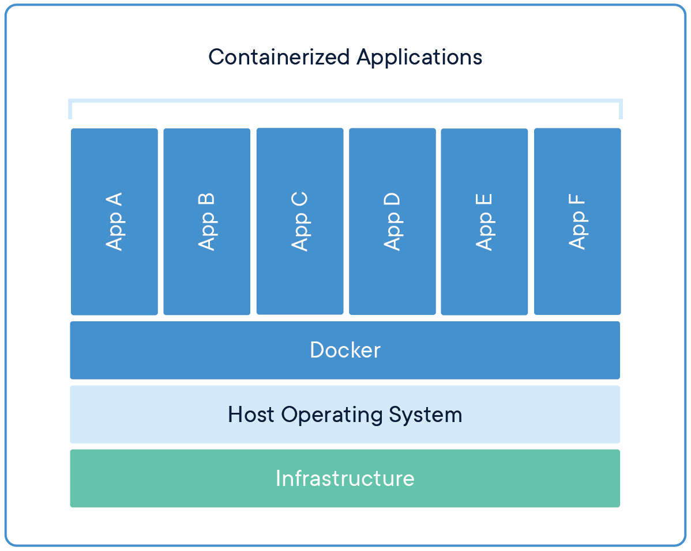

## The Need for Containers
Splunk Enterprise is most commonly deployed with dedicated hardware, and in configurations to support the size of your organization. Expanding your Splunk Enterprise service using only dedicated hardware involves procuring new hardware, installing the operating system, installing and then configuring Splunk Enterprise. Expanding to meet the needs of your users rapidly becomes difficult and overly complex in this model.

The overhead of this operation normally leads people down the path of creating virtual machines using a hypervisor. A hypervisor provides a significant improvement to the speed of spinning up more compute resources, but comes with one major drawback: the overhead of running multiple operating systems on one host.

## The Advent of Docker
In recent years, [Docker](https://www.docker.com) has become the de-facto tool designed make it easier to create, deploy, and run applications through the use of containers.

Containers allow an application to be the only process that runs in a VM-like, isolated environment. Unlike a hypervisor, a container-based system does not require the use of a guest operating system. This allows a single host to dedicate more resources towards the application.

For more information on how containers or Docker works, we'll [let Docker do the talking](https://www.docker.com/resources/what-container).

The Splunk user community has asked us to support containerization as a platform for running Splunk. The promise of running applications in a microservice-oriented architecture evangelizes the principles of infrastructure-as-code and declarative directives, and we aimed to bring those benefits with the work in this codebase. This project delivers on that request: to provide the rich functionality that Splunk Enterprise offers with the user-friendliness and production-readiness of container-native software.

## History
In 2015, Denis Gladkikh ([@outcoldman](https://github.com/outcoldman)) created an open-source GitHub repository for installing Splunk Enterprise, Splunk Universal Forwarder, and Splunk Light inside containers.

Universal Forwarders and standalone instances were being brought online at a rapid pace, which introduced a new level of complexity into the enterprise environment. In 2018, a new container image was created to improve the flexibility with which Splunk Enterprise could be operated in larger and more dynamic environments. The new Splunk container can now with a small environment and grow with the deployment. This, however, has caused a divergence from the open-source community edition of the Splunk Enterprise container.

As a result, containers for Splunk Enterprise versions prior to 7.1 can not be used with, or in conjunction with, this new version as it is not backward compatible. We are also unable to support version updates from any prior container to the current version released with Splunk Enterprise and Splunk Universal Forwarder 7.2, as the older versions are not forward compatible. We are sorry for any inconvenience this may cause.
